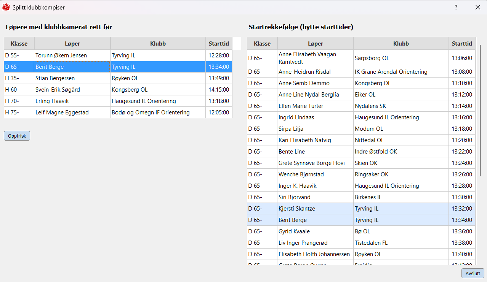

# Brikkesys/SvR Trekkeplan

Trekkeplan er en tilleggsmodul til Brikkesys for å planlegge og gjennomføre trekking av starttider.
Modulen er i form av et frittstående program som jobber mot Brikkesys databasen.

NB: Forutsetter at Brikkesys sin MySQL database er oppgradert til minst versjon 8.0, ref: https://brikkesys.no/usermanual/installasjon/mysql80

Versjon: 1.0 

Nedlasting : 
https://github.com/RekaaSv/trekkeplan

Funksjonalitet:
* Planlegge rekkefølge av klasser med støtte gjennom:
  * Sortere klassene på fritt valgt kolonne.
  * Rapporter - antall løpere pr. løype og pr. post1.
* Viser varghet på starten, ledigtid i båsene, uynyttelsesgrad av båsene.
* Utføre trekkingen
* Splitt løpere fra samme klubb som starter rett etter hverandre (se bilde under).
  * Ved å bytte starttid med den rett foran/ bak.
  * Ved å trekke enkeltklasse om igjen.
* Startlister
  * pr. klasse (for oppslag)
  * pr. starttid (for startpersonell) 

Utvikler/Support: 
Sveinung Rekaa 906 53 811 sveinung.rekaa@nenett.no

Ferdig planlagt:

Underveis i planleggingen:

Splitt av klubbkompiser:
